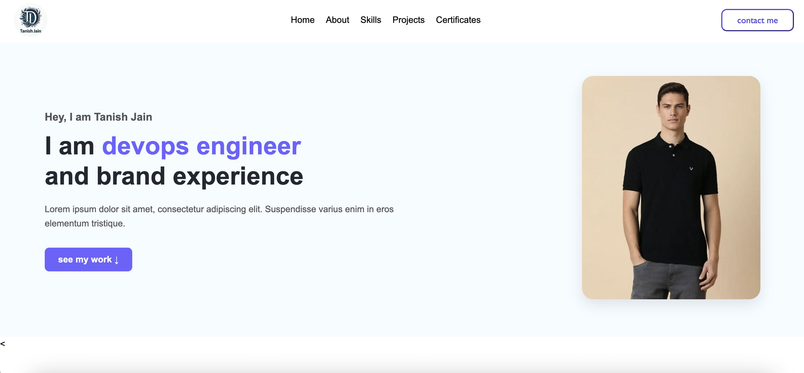

# 🌐  most basic Personal Portfolio - Tanish Jain

its protoype 

This is a responsive personal portfolio website built using **HTML**, **CSS**, and **JavaScript** to  practice 

## 📸 Preview



---

## 🛠 Tech Stack

- **Frontend**: HTML5, CSS3
- **Styling**: Pure CSS with custom components and layout
- **Interactivity**: JavaScript (vanilla)
- **Fonts**: Google Fonts (Roboto)
- **Design**: Responsive layout and modern UI/UX practices

---

## 📁 Project Structure

```plaintext
/
├── index.html         # Main HTML structure
├── style.css          # Stylesheet with custom styles
├── app.js             # JavaScript logic for scroll & form
├── photos/            # Images for hero, projects, certificates, etc.
```

💼 Features

👋 Hero section with introduction and CTA

👨‍💻 About Me section with a bio

🧠 Skills section (MERN, DevOps, Python, UI/UX)

💡 Projects section with image and GitHub links

📜 Certifications section with preview cards

📬 Contact Form with input validation (dummy submission)

🔗 Footer with useful links and social handles

⚙️ Setup Instructions:->

Clone this repository

git clone https://github.com/your-username/portfolio.git
cd portfolio
Open in browser
You can simply open index.html in any web browser.

💡 No build tools or frameworks needed. It’s 100% static and lightweight.

🔧 Future Improvements:->

Improve ui and  shift to advance design 

Integrate with an actual backend for contact form (e.g., EmailJS, Firebase, etc.)

Add animation libraries (e.g., AOS, GSAP)

Improve accessibility and SEO

Add blog or testimonial sections

🙋‍♂️ Author
Tanish Jain
LinkedIn | GitHub | Instagram

📜 License
This project is open source and free to use for personal inspiration. Please give credit if you fork or reuse.
